# Virtuasthenics
Web de gimnasio en la que se podrá tener un seguimiento de entrenamientos y realizar acciones tales como consultar entrenamientos completos, ejercicios en particular, clases, y dietas, registrarse como usuario, añadir entrenamientos a favoritos...

Video explicativo: https://youtu.be/N6-PSzV88c8

La parte pública de la web será básicamente la pantalla en la que se podrán loguear o registrarse en caso de que no tengan cuenta en la web

En cuanto a la parte privada de la web, los usuarios podrán realizar las acciones comentadas con anterioridad (consulta de entrenamientos, ejercicios, etc.)

Tipos de usuarios:
  - Invitado: podrán acceder a la web para consultar entrenamientos pero no podrán almacenar entrenamientos, ejercicios, dietas, etc. en sus favoritos.
  - Cliente: accede a la parte pública y privada de la web y tiene la ventaja de almacenar los entrenamientos que considere.
  - Entrenador/Administrador: usuario que, además de la consulta de entrenamientos, dispone de botones para dar de alta nuevos entrenamientos/ejercicios a la aplicación.

Entidades principales:
  - Usuario.
  - Entrenador.
  - Entrenamiento.
  - Ejercicio.
  - Clase.
  - Dieta.
  - Alimento
    
Funcionalidades servicio interno:
  - Envío de mails.
  - Generar PDF de un determinado entrenamiento.
  
Modelo E/R:
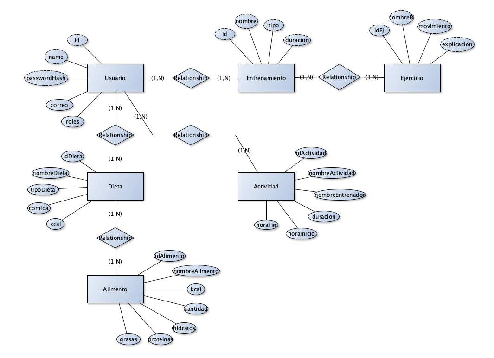

Pantallas:
  - Página principal.
  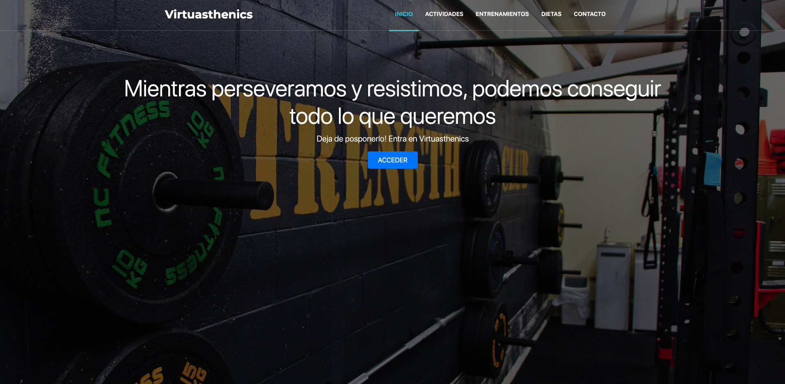
  - Clases.
  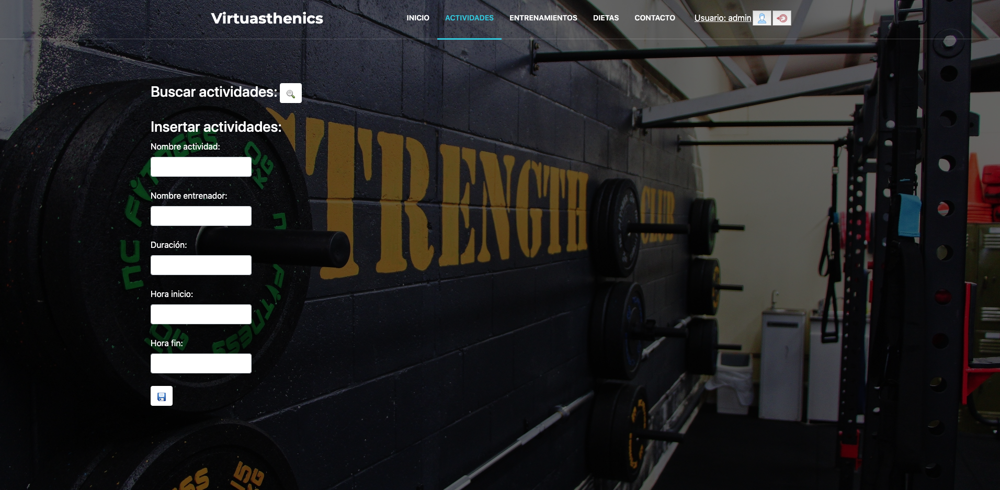
  - Búsqueda de clases.
  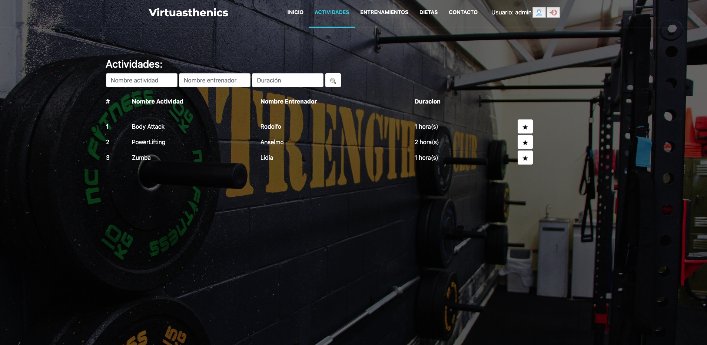
  - Entrenamientos.
  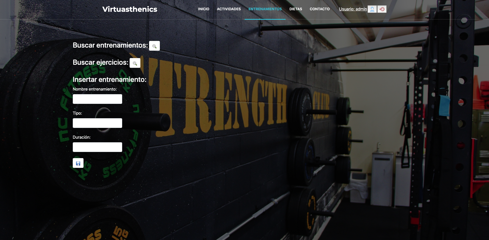
  - Búsqueda de entrenamientos.
  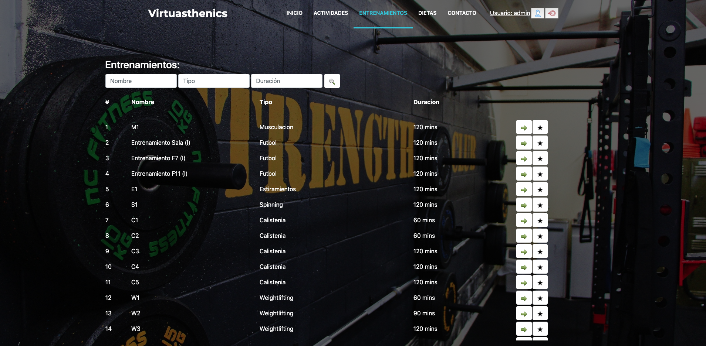
  - Búsqueda de ejercicios.
  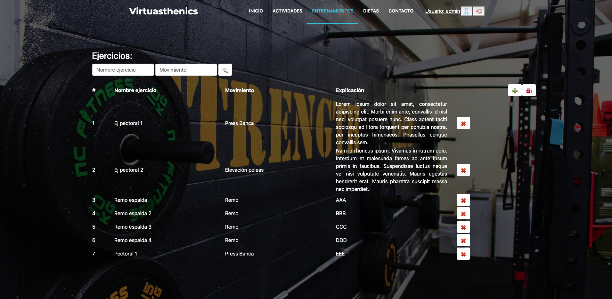
  - Dietas.
  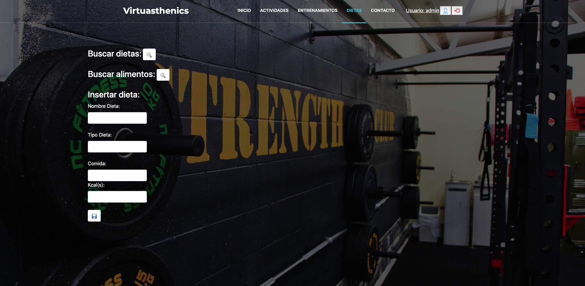
  - Búsqueda de dietas.
  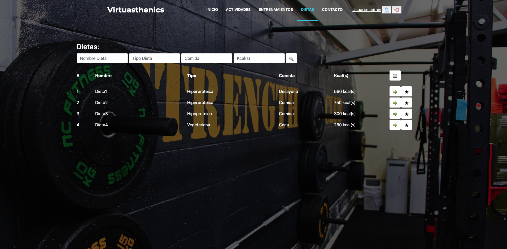
  - Búsqueda de alimentos.
  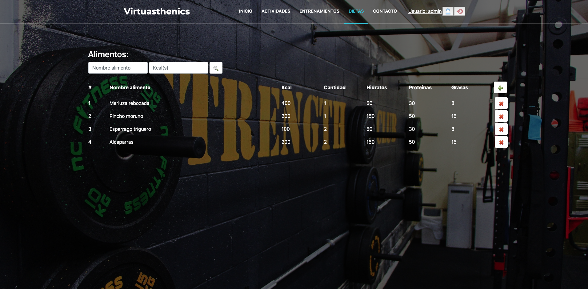
  
Diagrama de navegación:
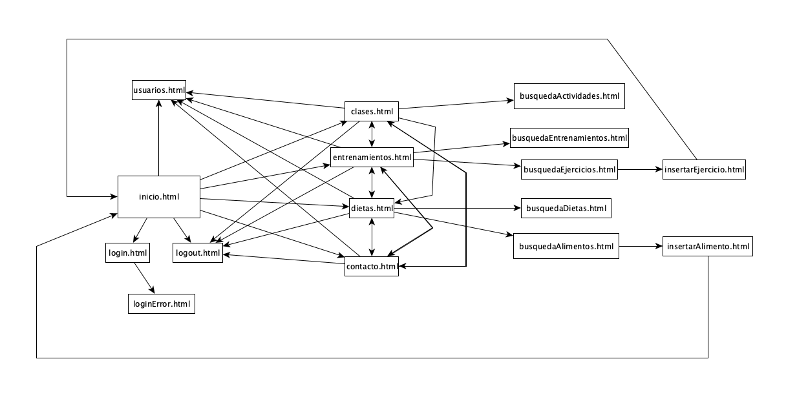

<h1>PASOS PARA DESPLEGAR APLICACIÓN EN UNA MÁQUINA VIRTUAL:</h1>

Crear carpeta vagrant.

Acceder a dicha carpeta vagrant mediante el comando cd vagrant.

Generar vagrantfile mediante: vagrant init ubuntu/trusty32.

Descomentar siguiente linea del vagrantfile:

# config.vm.network “private_network”, ip: “192.168.33.10”

Levantar máquina virtual mediante: vagrant up.

Accedo a la VM mediante: vagrant ssh.

Instalar Java:

sudo apt-get update

sudo add-apt-repository ppa:openjdk-r/ppa

sudo apt-get update

sudo apt-get install openjdk-8-jdk

Instalar mysql:

sudo apt-get update

sudo apt-get install mysql-server

sudo apt-get update

sudo apt-get install mysql-workbench

Acceder al entorno de mysql:

mysql -h localhost -u root -p

Create database virtuasthenics

Generar .jar del proyecto: mvn package.

Colocarlo en la carpeta vagrant generada anteriormente.

En la máquina virtual acceder a la carpeta compartida /vagrant y navegar hasta la carpeta donde esté el fichero jar de nuestra aplicación

Ejecutar la instrucción Java - Jar virtuasthenics.jar

Abrir con navegador en http://192.168.33.10:8080

Abrir con navegador en https://192.168.33.10:8443 (Spring Security)

Ctrl + c para parar la aplicación

Exit para salir.

<h1>DOCKERIZACIÓN DE LA APP:</h1>

Mediante un terminal acceder a la carpeta donde tenemos el fichero docker-compose.yml junto con el fichero haproxy.cfg y las carpetas de las aplicaciones (app web y servicio interno)

Con Docker arrancado, ejecutar el comando docker-compose up --build

Comenzarán a arrancarse todos los contenedores configurados en el fichero docker-compose.yml

Una vez arrancados se podrá acceder a la aplicación mediante https://localhost o https://localhost:443 

Y se podrán consultar las STATS del balanceador con esta url: localhost:8404/admin?stats

<h1>HAPROXY STATS:</h1>

STATS de haproxy: los dos nodos de la app arrancados

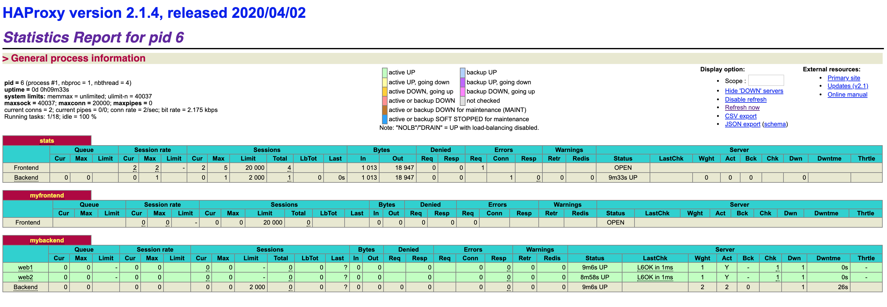

STATS de haproxy: uno de los nodos de la app caído

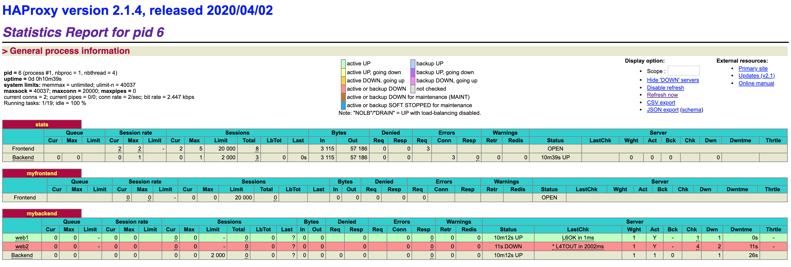
